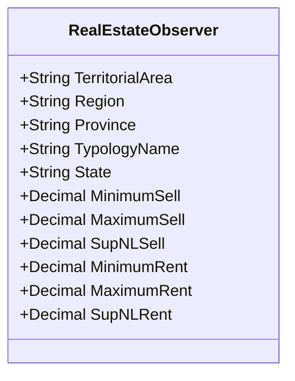

# This readme is in working

# How claim this project

The omi load file is a project that read the file that Agenzia delle entrate give two times on year, This files contains 
very important information about cost of sell or rent of house by zone and country.

This file report you the content of this project and the logical flow to make a work.

## Principal project step

1. Read two file called OMI_VALUE_*<"YEAR">*.csv and OMI_ZONE_*<"YEAR">*.csv
2. Check that the present municipality exists in Italy
3. The municipality that aren't find, save on table not found municipality

After this 3 step, i want explain the header that you can find in the file.
For the OMI_VALUE_*<"YEAR">*.csv, you can find the next header:

* Area_territoriale: Represent the place or zone in Italy
* Regione: The name of Italy region 
* Prov: The name of Italy province
* Comune_ISTAT: Identification created by the institute of statistics 
* Comune_cat: Identification created by the catasto (place where the real estate is registered)
* Sez: I don't know, can be empty
* Comune_amm: Identification used by municipality
* Comune_descrizione: Name of municipality
* Fascia
* Zona
* LinkZona: Identification used to link with other field in the OMI_ZONE_*<"YEAR">*.csv
* Cod_Tip: Code of topologies
* Descr_Tipologia: Name of topologies
* Stato: State of real estate -> Good, Bad, Less or More.
* Stato_prev
* Compr_min: Minimum value to sell the real estate
* Compr_max: Maximum value to sell the real estate
* Sup_NL_compr
* Loc_min: Minimum value to rent the real estate
* Loc_max: Maximum value to rent the real estate
* Sup_NL_loc

In the file all field are in italy, but in the code all field are in english for right comprehension
For the OMI_ZONE_*<"YEAR">*.csv, you can find the next header:


* Area_territoriale: Represent the place or zone in Italy
* Regione: The name of Italy region
* Prov: The name of Italy province
* Comune_ISTAT: Identification created by the institute of statistics
* Comune_cat: Identification created by the catasto (place where the real estate is registered)
* Sez: I don't know, can be empty
* Comune_amm: Identification used by municipality
* Comune_descrizione: Name of municipality
* Fascia
* Zona_Descr
* Zona
* LinkZona: Identification used to allow other field in OMI_VALUE_*<"YEAR">*.csv link with this
* Cod_tip_prev: Code of previous topologies
* Descr_tip_prev: Name of previous topologies
* Stato_prev: Previous state of real estate
* Microzona

In the file all field are in italy, but in the code all field are in english for right comprehension

When it two file are loaded and us verified that the municipalities exist, them us proceeding to take old real estate 
evaluation and move this in another table on database.

## Defining the schema for data

The next is the schema where the information is saved. This project call another service to retrieve the needed 
information.

The other service that is called for retrieve the municipality information is ()[] 

### The schema

The schema that contains the information is:

For the simple schema us used postgresql.

For retrieve the data us create another microservice that is ()[].

## Technologies used

In this project us used the follow technologies:

1. Scala 2.13.16
2. Spark 4.0.0
3. Docker 
4. Postgresql

## How run this project

To run this project you can run the next command
```shell
scala omi-load-file.jar --file [<name-file-omi-value>,<name-file-omi-zone>]
```

## Collaborate to this project

If you see that something could be better, you can make a fork of this project, make a change and create a pull request.
Remember that the pull request must be tested.